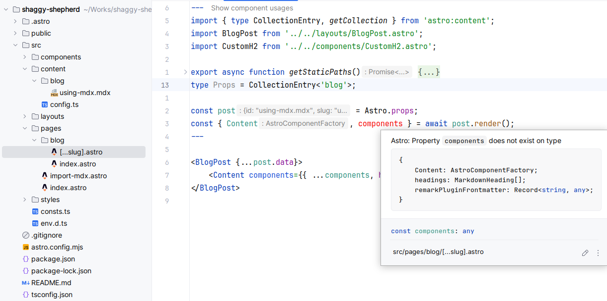
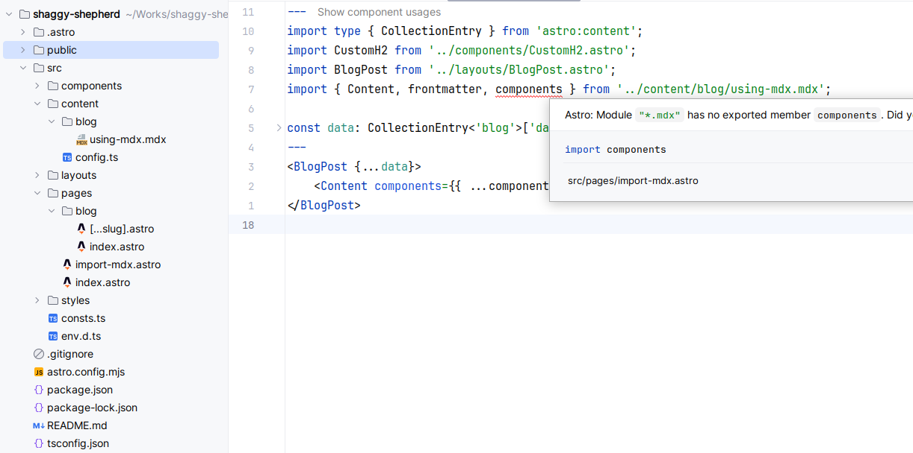

# render-mdx-components-missing-type-issue

Minimal reproduction repo for `astro:content` module’s `Render['.mdx']` type definition
lacking a `components` property.

1. npm ci
2. npm run build
3. Inspect with your IDE `pages/blog/[...slug].astro`
    
4. Inspect with your IDE `pages/import-mdx.astro`
   

## Notes

Project created from `npm create astro@latest`. 
Unused parts and content have been removed.

```
> npx
> create-astro


 astro   Launch sequence initiated.

   dir   Where should we create your new project?
         ./shaggy-shepherd

  tmpl   How would you like to start your new project?
         Use blog template

    ts   Do you plan to write TypeScript?
         Yes

   use   How strict should TypeScript be?
         Strict

  deps   Install dependencies?
         Yes

   git   Initialize a new git repository?
         No
      ◼  Sounds good! You can always run git init manually.

      ✔  Project initialized!
         ■ Template copied
         ■ TypeScript customized
         ■ Dependencies installed

  next   Liftoff confirmed. Explore your project!

         Enter your project directory using cd ./shaggy-shepherd 
         Run npm run dev to start the dev server. CTRL+C to stop.
         Add frameworks like react or tailwind using astro add.

         Stuck? Join us at https://astro.build/chat

╭──☠️─╮  Houston:
│ ◠ ◡ ◠  Good luck out there, astronaut! 🚀
╰──🦴─╯
```

